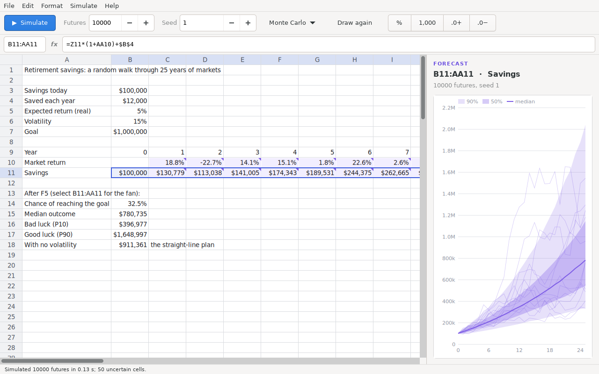
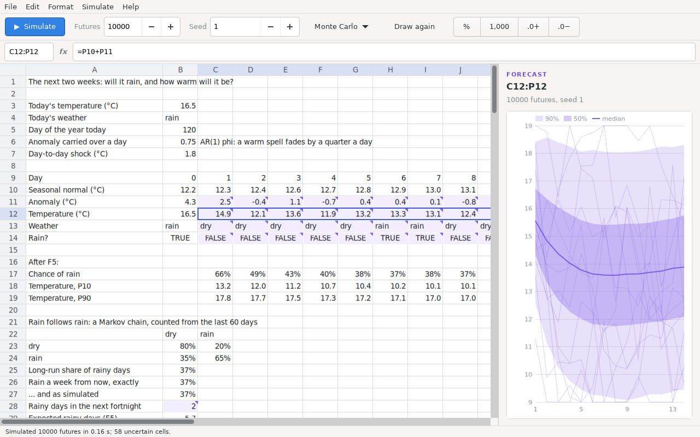
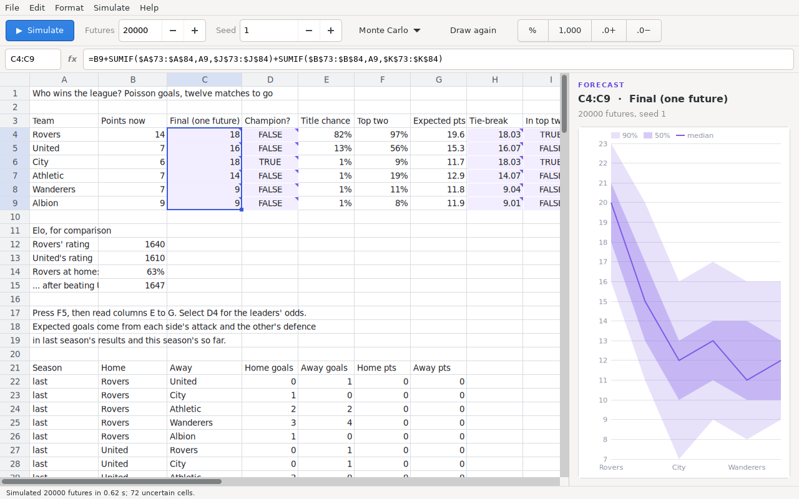
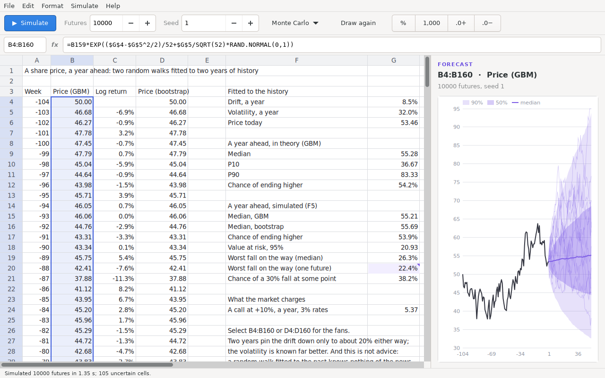

# Time Machine

**Time Machine** (the binary is `timemachine`) is a spreadsheet for making
predictions about the future: tomorrow's weather, who wins the league, where
a share price will be in a year, what a product launch will earn. It looks and works like Excel, and every
number in it can be a *range* instead of a single guess. Press **F5** and
it lives through ten thousand possible futures. For any cell it then shows
what could happen: the most likely outcome, the 90% range, the chance of a
loss, and which inputs matter most.

It is written from scratch in C on GTK 4, Pango and Cairo, with a Meson
build — the same stack and the same principles as its sister project
[office42-spreadsheet](https://github.com/office-42/office42-spreadsheet):
a small, honest codebase that does one thing well.


## How it predicts

Most spreadsheets give one answer to "what will profit be next year?",
and that answer is almost always wrong. Time Machine is built on the
methods that forecasters, risk analysts and superforecasters use instead.
[docs/METHODS.md](docs/METHODS.md) explains each one;
[docs/RESEARCH.md](docs/RESEARCH.md) has the formulas and sources.

- **Monte Carlo simulation.** An uncertain cell holds a distribution:
  `=RAND.PERT(80,100,150)` or `=RAND.LOGCI(20000,80000)`. The sheet is
  recalculated with fresh random draws thousands of times, and every cell
  that depends on the uncertain ones gets a distribution of its own.
  `=SIM.PROB(B14,"<0")` is then the chance of a loss.
- **Calibrated estimates.** Following Hubbard's *How to Measure Anything*,
  you give a range you are 90% sure of rather than a single number
  (`RAND.CI`, `RAND.LOGCI`). You can also give a three-point estimate
  (`RAND.PERT`, `RAND.TRIANGULAR`).
- **Time-series forecasting.** `FORECAST.ETS` uses exponential smoothing
  (Holt–Winters), finds the length of the season by itself, and gives
  prediction intervals. `FORECAST.LINEAR`, `TREND` and `GROWTH` fit
  regression lines. `RAND.ETS` and `RAND.LINEAR` draw from a forecast's
  error, so an extrapolation's uncertainty flows into the simulation.
- **Stochastic processes.** Random walks and geometric Brownian motion
  (`RAND.GBM`), and bootstrap resampling of history (`RAND.BOOTSTRAP`).
- **Judgment and keeping score.** Bayes' rule (`BAYES`), pooling
  forecasters by the geometric mean of their odds (`POOL.ODDS`),
  extremizing (`EXTREMIZE`), Laplace's rule of succession (`LAPLACE`),
  reference-class forecasting (`REFCLASS`), an expert's three percentiles
  as a metalog distribution (`RAND.METALOG`), and scoring forecasts
  against what happened (`BRIER`, `LOGSCORE`).
- **Sensitivity.** A tornado chart ranks the inputs by how much each one
  drives the selected output (`SIM.CORREL` puts the figure in a cell).
  `SIM.TAILMEAN` gives the average of the worst futures (expected
  shortfall).
- **Fair comparisons.** Every uncertain cell draws from a random stream
  of its own. Editing one cell leaves the others' draws alone, and two
  versions of a model run with the same seed see the same futures.
- **Latin hypercube sampling**, @RISK's default, covers each input's
  range evenly, so results settle with far fewer futures.

Select one uncertain cell to see a histogram of its futures. Select a row
or column of them — a quantity month by month — to see a fan chart that
grows out of the history before it:



## What it can predict

The same machinery works for any kind of future. What changes between
domains is the method used to describe how the future unfolds, and there
are functions for the standard methods of each.

**Weather.** Whether it rains tomorrow depends on whether it rains today.
A Markov chain captures that: `MARKOV.ESTIMATE` counts the transitions in
the last 60 days, `RAND.MARKOV` walks the chain forward one day at a time,
and `MARKOV.PROB` and `MARKOV.STEADY` give the exact answers to check the
simulation against. Temperature is the seasonal normal plus an anomaly
that fades by a quarter a day (`RAND.AR1`). `BRIER.SKILL` scores rain
forecasts against climatology, as weather services score theirs.



**Football.** Goals are Poisson counts. `MATCH.XG` estimates each side's
expected goals from attacking and defensive strength in past results.
`POISSON.MATCH` turns those into home/draw/away chances, with Dixon and
Coles' low-score correction, and `POISSON.SCORE` gives exact scores. The
example plays the rest of a season 20,000 times to give every team's
title chance. `ELO.EXPECT` and `ELO.UPDATE` do Elo ratings.



**Stock prices.** `DRIFT` and `VOLATILITY` fit geometric Brownian motion
to a price history. The example then walks two random walks a year
forward: one with normal weekly returns, and one resampling the history's
own returns (`RAND.BOOTSTRAP`), which keeps its fat tails. `GBM.PROB` and
`GBM.PERCENTILE` give the exact answers. The example also reports value
at risk, the worst fall along the way (`DRAWDOWN`), and what the market
charges for an option (`BLACKSCHOLES`).



**Anything that grows or spreads.** Every forecast should first be
checked against the naive, seasonal-naive and drift benchmarks
(`FORECAST.DRIFT`, `FORECAST.SNAIVE`). There is Holt's damped trend
(`FORECAST.DAMPED`), mean reversion (`FORECAST.AR1`), and the S-curves
of adoption: `LOGISTIC`, `GOMPERTZ`, and Bass diffusion (`BASS`) for a
new product's take-up. `RAND.SPLITNORMAL` draws the Bank of England's
lopsided fan-chart distribution.

## Examples

**File › Open Example** has eight models. Each one shows a different method:

| Example | Method |
|---|---|
| Weather | A Markov chain for rain, estimated from 60 days of observations; an AR(1) temperature anomaly around a seasonal normal; the exact Markov answers beside the simulated ones. |
| Football | Expected goals from attack and defence strengths, Poisson match probabilities with the Dixon–Coles correction, the rest of the season simulated for title chances, and Elo. |
| Stock price | Drift and volatility fitted to two years of prices; geometric Brownian motion and a bootstrap of the history's own returns; value at risk, drawdown and an option's price. |
| Product launch | Monte Carlo with PERT, lognormal, triangular and Bernoulli inputs. Also shows the chance of a loss, expected shortfall, what drives profit, and the *flaw of averages* (the plan built from average inputs is not the average outcome). |
| Sales forecast | Holt–Winters exponential smoothing on three years of seasonal sales, with the forecast drawn as a fan out of the history. |
| Retirement savings | A 25-year geometric random walk of market returns: the chance of reaching a goal, compared with the straight-line plan. |
| Project schedule | Three-point (PERT) estimates, and the *merge bias* that makes plans built from averages run late on average. |
| Forecasting tournament | Brier and log scores for two forecasters and their crowd, extremizing, and Bayes' rule checked against a simulation. |

## Building

You need a C compiler, Meson, Ninja, and the development files for
GTK 4.10 or later.

```sh
# Debian / Ubuntu
sudo apt install gcc meson ninja-build libgtk-4-dev
# Fedora
sudo dnf install gcc meson ninja-build gtk4-devel

meson setup builddir
meson compile -C builddir
./builddir/src/timemachine samples/launch.tm
```

`meson install -C builddir` installs the program, its desktop entry, its
icon and the examples.

## The terminal front-end

`timemachine-calc` runs the same engine without a window. It reads
commands on standard input:

```sh
$ ./builddir/src/timemachine-calc <<'EOF'
A1 = =RAND.PERT(800,1000,1500)
A2 = =RAND.NORMAL(20,2)
A3 = =A1*A2-15000
simulate
stats A3
EOF
simulated 10000 iterations, seed 1, 3 cells kept
A3	iterations=10000 valid=10000 mean=5989.59 sd=3305.74 se=33.1
A3	min=-3509.26 p5=1037.5 p10=1944.16 p25=3633.16 p50=5698.69 p75=8141.3 p90=10449.7 p95=11878.1 max=20573
```

It also has `histogram`, `fan`, `dump`, `load`, `save`, `export` (all
samples to CSV), `format`, `undo`, `redo`, `filldown`, `fillright`,
`copy` and `functions`.
[docs/GUIDE.md](docs/GUIDE.md) is the user guide.
`sh build-aux/smoke-test.sh builddir/src/timemachine-calc` checks the
engine end to end. It compares simulated means with what theory says.

## Files

A model is saved as a `.tm` file. It is plain text, one line per cell,
so it can be read, diffed and kept in version control:

```
timemachine 1
iterations	10000
seed	1
cell	A4	Market size (units a year)
cell	B4	=RAND.LOGCI(80000,300000)
```

CSV files open as data and save as values. **File › Export Samples**
writes every simulated future of every uncertain cell to CSV, for
analysis elsewhere.

## Status

This is an early version. The engine, the simulator and the forecasting
functions are done and checked. The window covers the essentials: a grid,
a formula bar, fill, copy and paste, undo, number formats, the
forecast panel, in-cell editing and point mode.
[docs/ROADMAP.md](docs/ROADMAP.md) lists what comes next. There are 165
functions; **Help › Functions** (F1) lists them all.

## License

GPL-3.0-or-later. See [LICENSE](LICENSE).
