# Gallery

What Time Machine looks like, feature by feature. Every picture here is
the real program, rendered headlessly; [how](#how-these-were-made) is at
the end.

## The spreadsheet

A model is an ordinary sheet whose uncertain cells (tinted) hold
distributions. After **F5** the panel on the right shows what the
selected cell's futures look like: a histogram marked at P5, P50 and
P95, the statistics in the cell's own format, and a tornado chart of
what drives it.


While a formula is typed, clicking or dragging over cells puts their
reference in, marked with a dashed border, as in Excel:

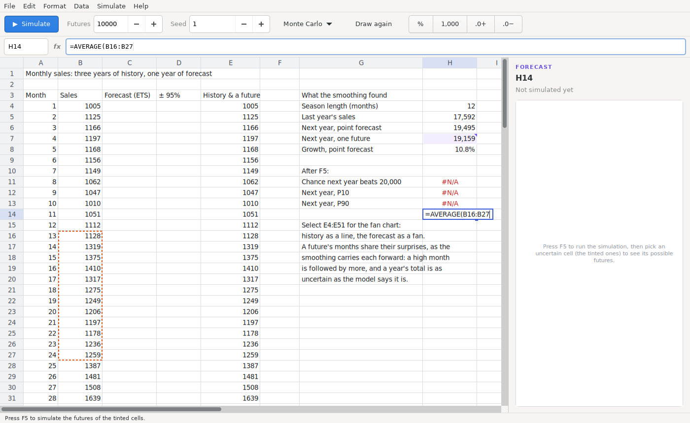

**File › Open Example** has sixteen models, one method each, and
**Help › Functions** (F1) lists all 249 functions, with a search box:


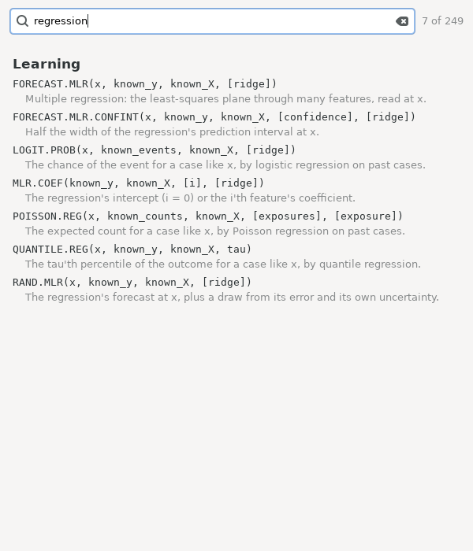

## Fans: a quantity over time

Select a row or column and the panel draws the 50% and 90% bands of its
futures, the median, and a dozen single futures, growing out of the
plain values before them.


The months of an exponential-smoothing forecast share their surprises,
so the fan is as wide as the model says, and single futures wander as
real ones do:

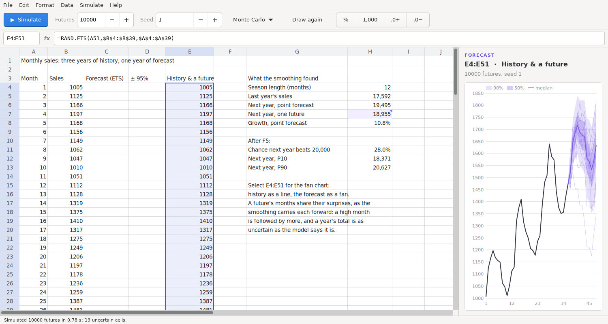

A column of measurements continued by a forecast: green cover read off
six weekly photographs, then a logistic curve fitted to it, the line's
own uncertainty shared across the weeks:

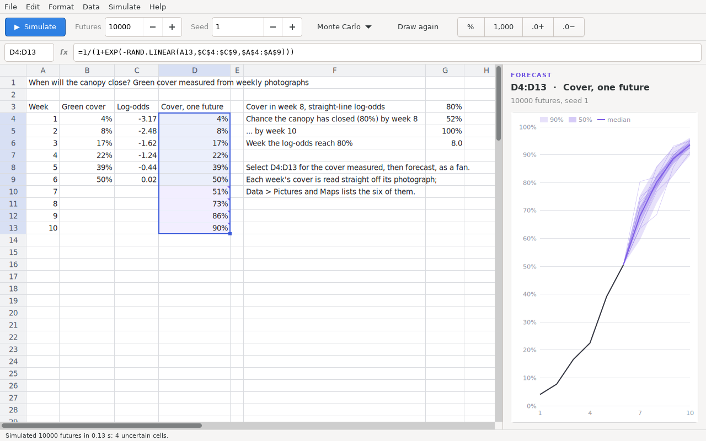

## Learning from past cases

Sixty past projects as a table; the new one as a row of features.
Nearest analogues, multiple, quantile and logistic regression, a
conformal interval from the last twenty projects' own misses, and then
the decision: bid a fixed price, or cost plus? The histogram is the
fixed-price profit on the regression's overruns — a loss in almost a
third of futures; the chance it is the better deal (37%), what knowing
the overrun first would be worth, and the certainty equivalents are
beside it.

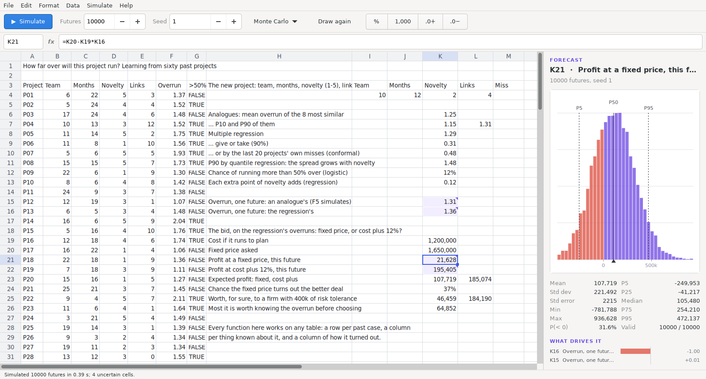

Rates learnt from counts by Bayes' rule: the new page's lift over the
old, the chance it is really better (95%), and eight landing pages
pooled so that small samples are trusted only as far as they deserve:

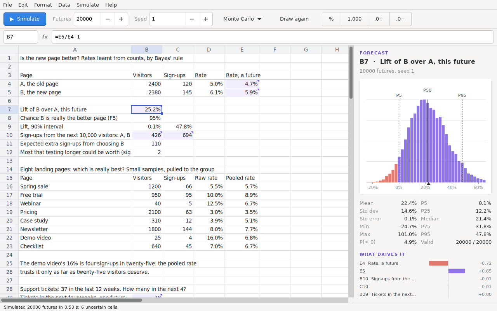

Lifetimes, some of them not over yet: a Weibull fitted by maximum
likelihood counting the pumps still running, Kaplan–Meier beside it, and
the hour our pump, 3,000 hours old, fails:

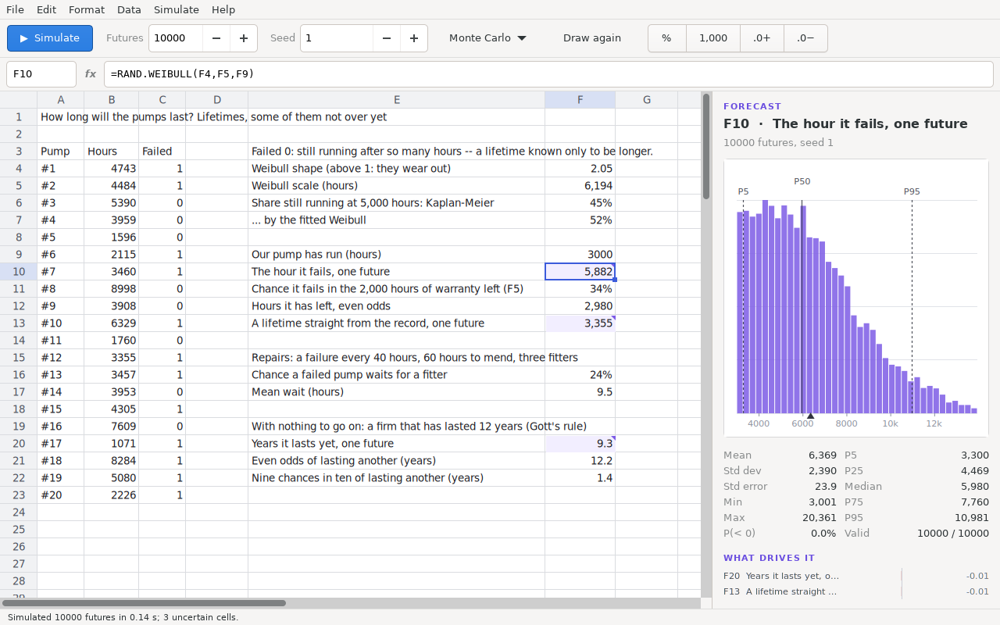

Futures that come out as words are counted:

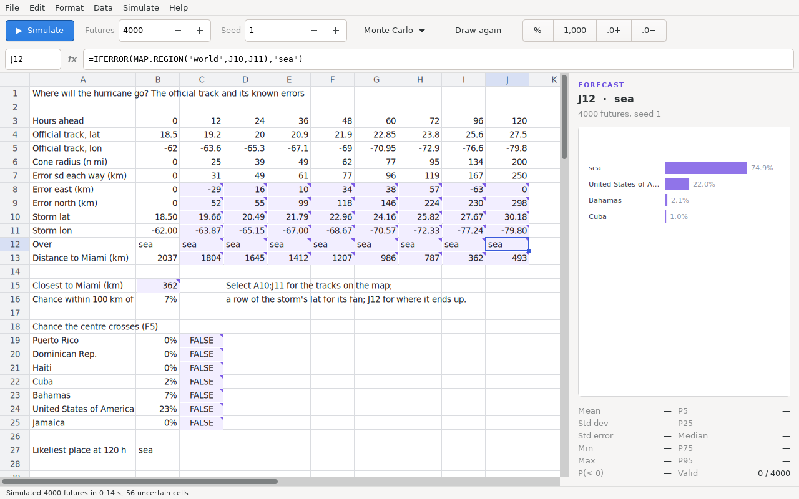

## Pictures and maps

Pictures and maps are loaded under a name and read by formula.
**Data › Pictures and Maps** lists them, with a picture's place on the
Earth:

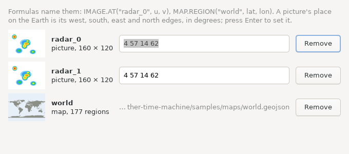

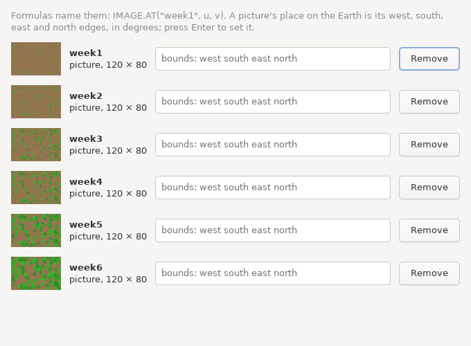

Places on a map: home on the latest radar frame, over the coast of
southern Norway and Sweden, with the rain approaching from the west:

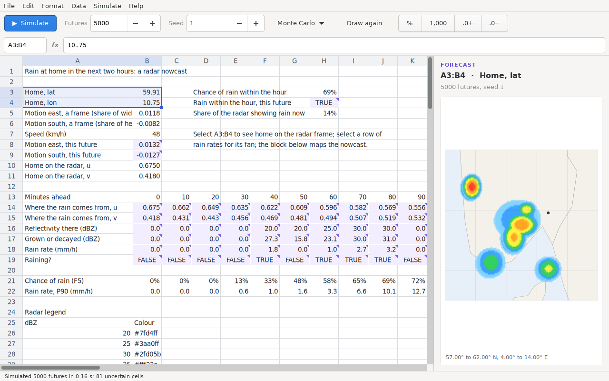

A block of cells is a heat map. Here the radar an hour ahead, every cell
read through the colour legend at the point its rain comes from:

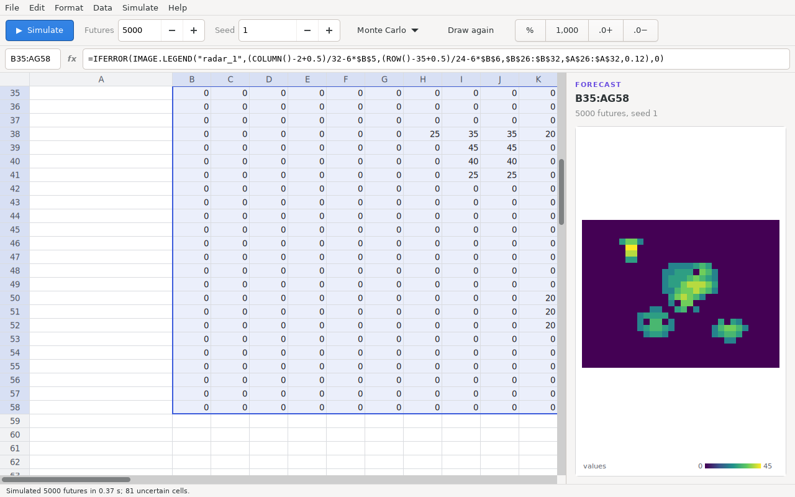

The fuel under a wildfire, read off a land-cover picture through its
legend — forest, grass, town, road and water — and the chance each cell
burns, from a fire spread two thousand times with the wind:

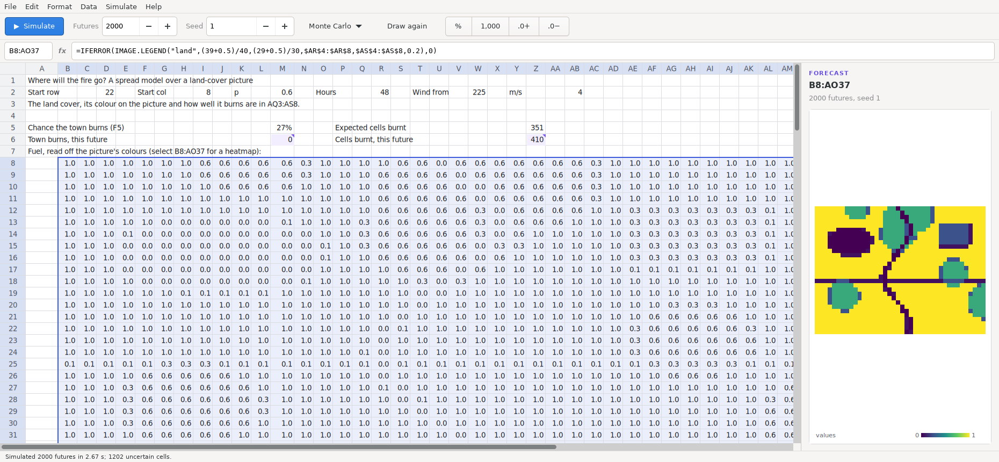

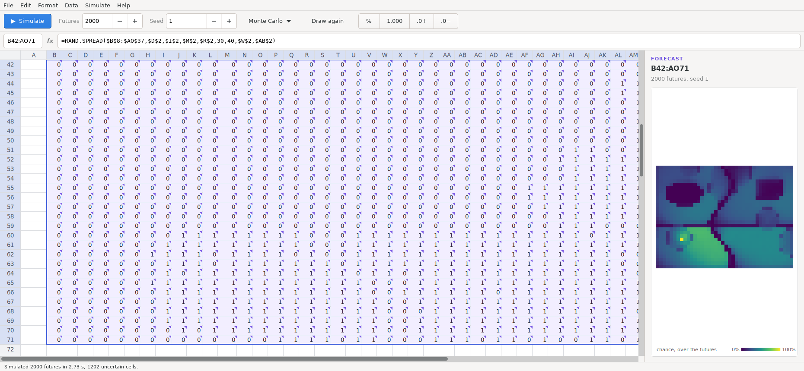

Tracks: the official hurricane forecast with the National Hurricane
Center's cone errors as a random walk, a hundred simulated tracks drawn
over the world map:

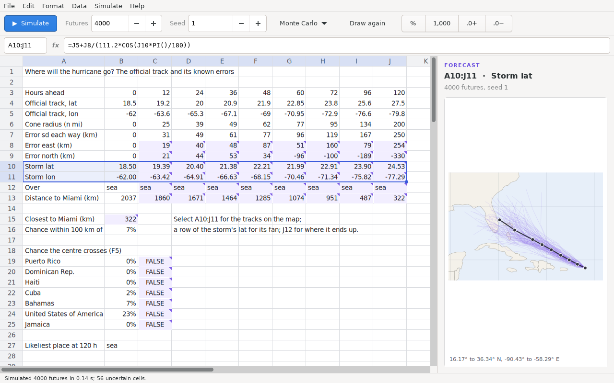

Stations, coloured by what they measured, with kriging between them:

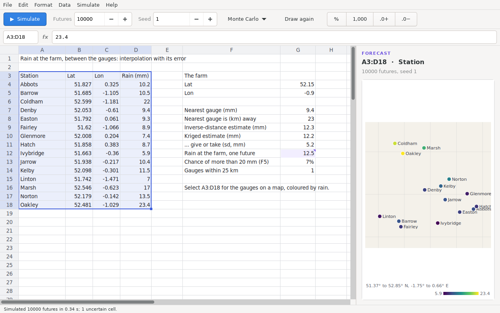

## Particular futures


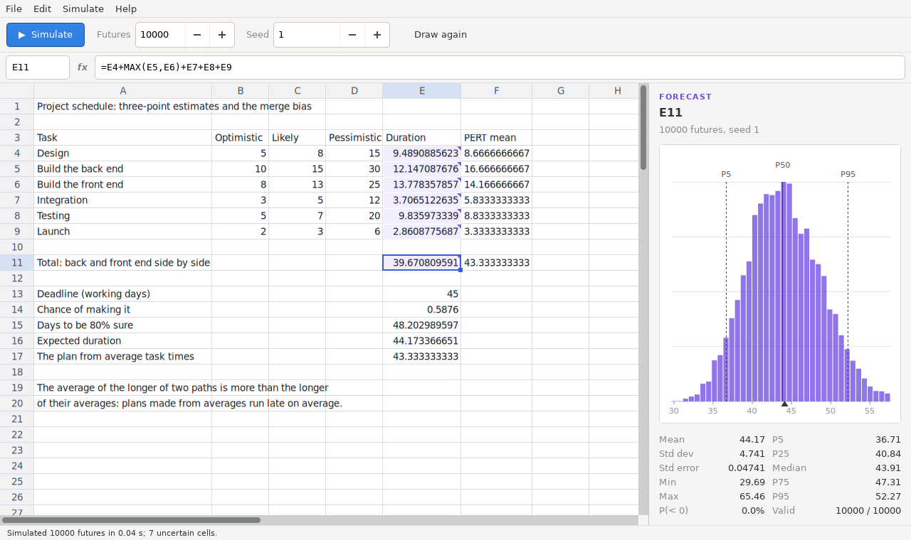

## How these were made

The window renders itself to a PNG without a display:

```sh
GSK_RENDERER=cairo xvfb-run -a -s "-screen 0 1920x1080x24" \
  builddir/src/timemachine samples/abtest.tm --simulate --select B7 \
  --size 1280x800 --screenshot abtest.png
```

`--select` takes a cell or a range; the wider sheets used `--size
1600x860` or more. The menus, dialogs and the pointing picture were made
by driving the window under Xvfb with `xdotool` and capturing it with
ImageMagick's `import`.
